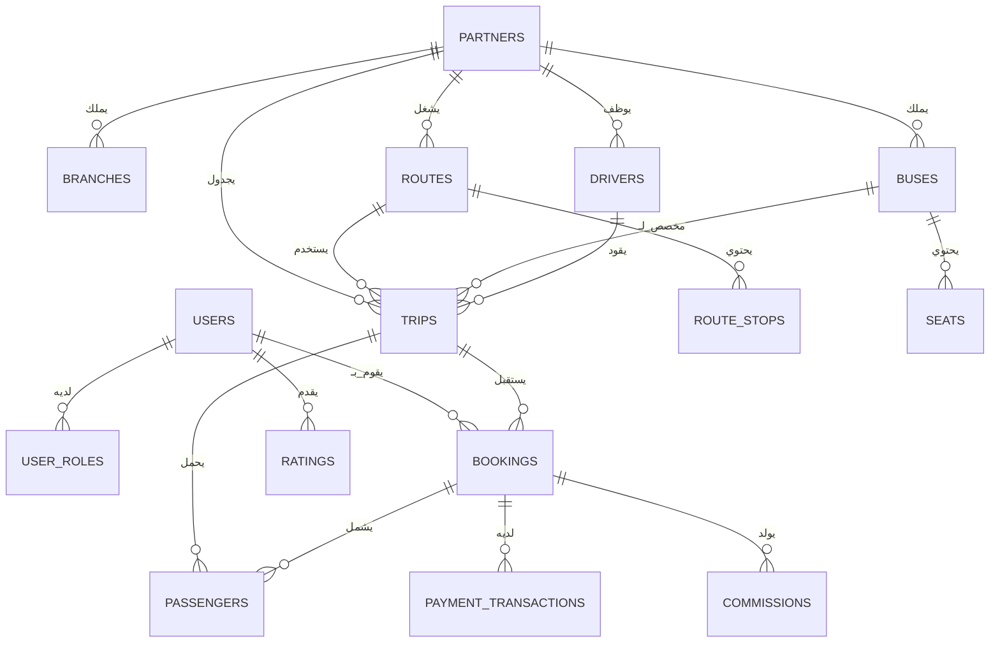

# تقرير تدقيق قاعدة البيانات
## نظام حجز الحافلات - تحليل شامل

**تاريخ التدقيق:** 2026-01-26  
**نظام قاعدة البيانات:** PostgreSQL (Supabase)  
**دور المدقق:** مهندس معماري أول لقواعد البيانات وأخصائي سلامة البيانات

---

## الملخص التنفيذي

يقيّم هذا التدقيق هيكل قاعدة البيانات لمنصة حجز حافلات متعددة المستأجرين. يُظهر الهيكل **نضجًا متوسطًا** مع عدة نقاط قوة في الأمان (سياسات RLS) ومنطق الأعمال (سياسات الإلغاء، تتبع العمولات). ومع ذلك، توجد **مشاكل هيكلية حرجة** تُعرّض سلامة البيانات للخطر، وتخلق مخاطر أداء، وتنتهك مبادئ التطبيع.

**التقييم العام:** ⚠️ **يتطلب اهتمامًا فوريًا**

---

## 1. الربط بين الجداول وسلامة العمليات

### 1.1 قيود المفاتيح الأجنبية المفقودة

> [!CAUTION]
> **مشكلة حرجة:** الهيكل لا يحدد أي قيود مفاتيح أجنبية صريحة رغم وجود العديد من التبعيات العلائقية. هذا انتهاك خطير لأفضل ممارسات قواعد البيانات العلائقية.

#### المفاتيح الأجنبية المفقودة المحددة:

| الجدول الفرعي | العمود | يجب أن يشير إلى | التأثير |
|---------------|---------|------------------|----------|
| `user_roles` | `user_id` | `auth.users(id)` | إمكانية وجود سجلات أدوار يتيمة |
| `user_roles` | `partner_id` | `partners(partner_id)` | مراجع شركاء غير صالحة |
| `partner_applications` | `auth_user_id` | `auth.users(id)` | طلبات يتيمة |
| `partner_applications` | `partner_id` | `partners(partner_id)` | روابط شركاء غير صالحة |
| `branches` | `partner_id` | `partners(partner_id)` | فروع يتيمة |
| `users` | `auth_id` | `auth.users(id)` | عدم تطابق الملف الشخصي/المصادقة |
| `employees` | `user_id` | `users(user_id)` | مراجع مستخدمين غير صالحة |
| `employees` | `partner_id` | `partners(partner_id)` | مراجع شركاء غير صالحة |
| `drivers` | `partner_id` | `partners(partner_id)` | سائقون يتامى |
| `buses` | `partner_id` | `partners(partner_id)` | حافلات يتيمة |
| `buses` | `bus_class_id` | `bus_classes(bus_class_id)` | مراجع فئات غير صالحة |
| `seats` | `bus_id` | `buses(bus_id)` | مقاعد يتيمة |
| `routes` | `partner_id` | `partners(partner_id)` | ملكية مسارات غير صالحة |
| `route_stops` | `route_id` | `routes(route_id)` | محطات يتيمة |
| `trips` | `route_id` | `routes(route_id)` | مراجع مسارات غير صالحة |
| `trips` | `bus_id` | `buses(bus_id)` | تعيينات حافلات غير صالحة |
| `trips` | `driver_id` | `drivers(driver_id)` | تعيينات سائقين غير صالحة |
| `bookings` | `user_id` | `users(user_id)` | حجوزات مستخدمين غير صالحة |
| `bookings` | `trip_id` | `trips(trip_id)` | حجوزات رحلات غير صالحة |
| `passengers` | `booking_id` | `bookings(booking_id)` | ركاب يتامى |
| `passengers` | `seat_id` | `seats(seat_id)` | تعيينات مقاعد غير صالحة |
| `commissions` | `booking_id` | `bookings(booking_id)` | عمولات يتيمة |
| `payment_transactions` | `booking_id` | `bookings(booking_id)` | مدفوعات يتيمة |
| `refunds` | `booking_id` | `bookings(booking_id)` | استردادات يتيمة |
| `notifications` | `user_id` | `users(user_id)` | إشعارات يتيمة |
| `ratings` | `user_id` | `users(user_id)` | مراجع مستخدمين غير صالحة |
| `ratings` | `trip_id` | `trips(trip_id)` | مراجع رحلات غير صالحة |

**العواقب:**
- **البيانات اليتيمة:** يمكن أن توجد سجلات فرعية بدون سجلات أصلية صالحة
- **انتهاكات السلامة المرجعية:** لا يوجد فرض على مستوى قاعدة البيانات للعلاقات
- **مشاكل التسلسل:** إدارة الحذف يدويًا مطلوبة، عرضة للأخطاء
- **أداء الاستعلامات:** لا يمكن الاستفادة من فهارس المفاتيح الأجنبية للربط
- **خطر فساد البيانات:** أخطاء مستوى التطبيق يمكن أن تخلق بيانات غير متسقة

#### التوصيات:

```sql
-- أمثلة على إضافة المفاتيح الأجنبية (طبق النمط على جميع الجداول):

-- user_roles
ALTER TABLE public.user_roles 
  ADD CONSTRAINT fk_user_roles_user 
  FOREIGN KEY (user_id) REFERENCES auth.users(id) ON DELETE CASCADE;

ALTER TABLE public.user_roles 
  ADD CONSTRAINT fk_user_roles_partner 
  FOREIGN KEY (partner_id) REFERENCES public.partners(partner_id) ON DELETE SET NULL;

-- bookings (جدول حرج)
ALTER TABLE public.bookings 
  ADD CONSTRAINT fk_bookings_user 
  FOREIGN KEY (user_id) REFERENCES public.users(user_id) ON DELETE RESTRICT;

ALTER TABLE public.bookings 
  ADD CONSTRAINT fk_bookings_trip 
  FOREIGN KEY (trip_id) REFERENCES public.trips(trip_id) ON DELETE RESTRICT;

-- passengers
ALTER TABLE public.passengers 
  ADD CONSTRAINT fk_passengers_booking 
  FOREIGN KEY (booking_id) REFERENCES public.bookings(booking_id) ON DELETE CASCADE;

ALTER TABLE public.passengers 
  ADD CONSTRAINT fk_passengers_seat 
  FOREIGN KEY (seat_id) REFERENCES public.seats(seat_id) ON DELETE RESTRICT;

-- طبق نمطًا مماثلاً على جميع الجداول ذات العلاقات الأجنبية
```

**الأولوية:** 🔴 **حرج - نفذ فورًا**

---

### 1.2 نظام هوية المستخدم المزدوج

> [!IMPORTANT]
> النظام يحتفظ بجدولين منفصلين لهوية المستخدم (`auth.users` و `public.users`)، مما يخلق مخاطر مزامنة.

**الهيكل الحالي:**
```
auth.users (مصادقة Supabase)
    ↓ (مرجع auth_id)
public.users (ملفات التطبيق الشخصية)
    ↓ (مرجع user_id)
bookings, notifications, إلخ.
```

**المشاكل:**
1. **خطر المزامنة:** `public.users` يمكن أن يفقد المزامنة مع `auth.users`
2. **بيانات مكررة:** البريد الإلكتروني والاسم مخزنان في كلا المكانين
3. **استعلامات معقدة:** تتطلب ربطًا عبر كلا الجدولين لعمليات المستخدم
4. **اعتماد على المحفز:** يعتمد على محفز `handle_new_user()` الذي واجه مشاكل (حسب سجل الترحيل)

**الدليل من ملفات الترحيل:**
- `20251224223000_root_cause_fix.sql` يُظهر منطق تنظيف التكرارات
- إصلاحات متعددة لمشاكل مزامنة المستخدم/الدور

#### التوصيات:

**الخيار أ: إلغاء public.users (مفضل)**
```sql
-- ترحيل جميع مفاتيح user_id الأجنبية للإشارة إلى auth.users(id) مباشرة
-- تخزين بيانات الملف الشخصي الإضافية في جدول منفصل إذا لزم الأمر
CREATE TABLE public.user_profiles (
  auth_id UUID PRIMARY KEY REFERENCES auth.users(id) ON DELETE CASCADE,
  phone VARCHAR,
  preferences JSONB,
  created_at TIMESTAMPTZ DEFAULT NOW()
);
```

**الخيار ب: الاحتفاظ بالهيكل الحالي لكن تعزيزه**
```sql
-- إضافة قيد مفتاح أجنبي
ALTER TABLE public.users 
  ADD CONSTRAINT fk_users_auth 
  FOREIGN KEY (auth_id) REFERENCES auth.users(id) ON DELETE CASCADE;

-- إضافة قيد فريد (موجود بالفعل حسب الترحيل)
ALTER TABLE public.users 
  ADD CONSTRAINT users_auth_id_key UNIQUE (auth_id);
```

**الأولوية:** 🟠 **عالية - خطط للإصدار الرئيسي التالي**

---

## 2. منع تكرار البيانات والتطبيع

### 2.1 تقييم مستوى التطبيع

**التقييم العام:** الهيكل في حوالي **2NF (الشكل الطبيعي الثاني)** مع بعض الانتهاكات.

#### الانتهاكات المحددة:

**2.1.1 بيانات مالية غير مطبعة في جدول `bookings`**

> [!WARNING]
> جدول `bookings` يخزن قيمًا محسوبة يجب اشتقاقها أو تخزينها في جداول مخصصة.

```sql
CREATE TABLE public.bookings (
  -- ... حقول أخرى ...
  total_price numeric NOT NULL,           -- ✓ مقبول (لقطة المعاملة)
  platform_commission numeric,            -- ⚠️ يجب حسابها
  partner_revenue numeric,                -- ⚠️ يجب حسابها
  refund_amount numeric,                  -- ⚠️ تكرر booking_cancellations
  refund_timestamp timestamp,             -- ⚠️ تكرر booking_cancellations
  -- ...
);
```

**المشاكل:**
- `platform_commission` و `partner_revenue` قابلة للاشتقاق من `total_price` ونسبة العمولة
- `refund_amount` و `refund_timestamp` تكرر البيانات في `booking_cancellations` و `refund_transactions`

**التوصية:**

**إذا كانت هذه لقطات مقصودة** (لمسار تدقيق مالي):
```sql
-- إضافة تعليقات لتوضيح النية
COMMENT ON COLUMN bookings.platform_commission IS 
  'لقطة من العمولة وقت الحجز - لا تعيد الحساب';
COMMENT ON COLUMN bookings.partner_revenue IS 
  'لقطة من إيرادات الشريك وقت الحجز - لا تعيد الحساب';
```

**إذا كان يجب حسابها:**
```sql
-- إزالة الأعمدة الزائدة
ALTER TABLE bookings DROP COLUMN platform_commission;
ALTER TABLE bookings DROP COLUMN partner_revenue;
ALTER TABLE bookings DROP COLUMN refund_amount;
ALTER TABLE bookings DROP COLUMN refund_timestamp;

-- إنشاء عرض للقيم المحسوبة
CREATE VIEW bookings_with_financials AS
SELECT 
  b.*,
  b.total_price * (p.commission_percentage / 100) AS platform_commission,
  b.total_price * (1 - p.commission_percentage / 100) AS partner_revenue,
  bc.refund_amount,
  bc.cancelled_at AS refund_timestamp
FROM bookings b
JOIN trips t ON b.trip_id = t.trip_id
JOIN partners p ON t.partner_id = p.partner_id
LEFT JOIN booking_cancellations bc ON b.booking_id = bc.booking_id;
```

**الأولوية:** 🟡 **متوسطة - وضح النية، ثم نفذ**

---

**2.1.2 مرجع رحلة زائد في جدول `passengers`**

```sql
CREATE TABLE public.passengers (
  passenger_id bigint PRIMARY KEY,
  booking_id bigint,      -- يشير إلى bookings
  trip_id bigint,         -- ⚠️ زائد - قابل للاشتقاق من الحجز
  seat_id bigint,
  -- ...
);
```

**المشكلة:** `trip_id` زائد لأن:
```sql
-- يمكن اشتقاق trip_id:
SELECT t.trip_id 
FROM passengers p
JOIN bookings b ON p.booking_id = b.booking_id
JOIN trips t ON b.trip_id = t.trip_id;
```

**التوصية:**
```sql
-- إزالة العمود الزائد
ALTER TABLE passengers DROP COLUMN trip_id;

-- إذا كانت الاستعلامات تحتاج trip_id بشكل متكرر، أنشئ عرضًا مفهرسًا
CREATE MATERIALIZED VIEW passengers_with_trip AS
SELECT p.*, b.trip_id
FROM passengers p
JOIN bookings b ON p.booking_id = b.booking_id;

CREATE INDEX idx_passengers_trip ON passengers_with_trip(trip_id);
```

**الأولوية:** 🟢 **منخفضة - حسّن أثناء إعادة الهيكلة**

---

**2.1.3 جداول استرداد مكررة**

> [!CAUTION]
> يوجد جدولان منفصلان للاسترداد بأغراض متداخلة، مما يخلق ارتباكًا وعدم اتساق محتمل للبيانات.

**الجداول:**
1. `refunds` (الأسطر 426-439)
2. `refund_transactions` (الأسطر 442-466)

**التداخل:**
- كلاهما يتتبع `booking_id`، `refund_amount`، `status`، `created_at`
- كلاهما يتتبع تفاصيل طريقة الدفع (حساب بنكي، STC Pay)
- غير واضح أيهما موثوق

**التوصية:**

**الخيار أ: دمج في جدول واحد**
```sql
CREATE TABLE public.refund_transactions (
  refund_id BIGSERIAL PRIMARY KEY,
  booking_id BIGINT NOT NULL REFERENCES bookings(booking_id),
  user_id BIGINT NOT NULL REFERENCES users(user_id),
  
  -- التفاصيل المالية
  refund_amount NUMERIC NOT NULL,
  refund_fee NUMERIC DEFAULT 0,
  net_refund NUMERIC GENERATED ALWAYS AS (refund_amount - refund_fee) STORED,
  
  -- تفاصيل الدفع
  refund_method VARCHAR NOT NULL,
  original_payment_method VARCHAR,
  refund_reference VARCHAR,
  
  -- تفاصيل التحويل البنكي
  bank_name VARCHAR,
  bank_account VARCHAR,
  account_holder_name VARCHAR,
  
  -- تفاصيل STC Pay
  stc_pay_number VARCHAR,
  
  -- تتبع سير العمل
  status VARCHAR DEFAULT 'pending',
  initiated_by BIGINT REFERENCES users(user_id),
  processed_by BIGINT REFERENCES users(user_id),
  completed_by BIGINT REFERENCES users(user_id),
  
  -- ملاحظات
  customer_notes TEXT,
  internal_notes TEXT,
  
  -- الطوابع الزمنية
  created_at TIMESTAMPTZ DEFAULT NOW(),
  processing_started_at TIMESTAMPTZ,
  completed_at TIMESTAMPTZ,
  
  CONSTRAINT valid_refund_amount CHECK (refund_amount > 0)
);
```

**الأولوية:** 🟠 **عالية - وضح فورًا لمنع عدم اتساق البيانات**

---

### 2.2 القيود الفريدة ومنع التكرار

#### 2.2.1 القيود الفريدة المفقودة

> [!WARNING]
> عدة جداول تفتقر إلى قيود فريدة من شأنها منع التكرارات المنطقية.

| الجدول | القيد المفقود | الخطر |
|--------|---------------|-------|
| `buses` | `license_plate` | تسجيلات مركبات مكررة |
| `drivers` | `license_number` | رخص سائقين مكررة |
| `users` | `email` | عناوين بريد إلكتروني مكررة |
| `users` | `phone` | أرقام هواتف مكررة |
| `seats` | `(bus_id, seat_number)` | أرقام مقاعد مكررة لكل حافلة |
| `routes` | `(origin_city, destination_city, partner_id)` | مسارات مكررة |
| `route_stops` | `(route_id, stop_order)` | ترتيبات محطات مكررة |
| `partner_invoices` | `invoice_number` | أرقام فواتير مكررة |

**التوصيات:**

```sql
-- الحافلات: منع لوحات ترخيص مكررة
ALTER TABLE buses 
  ADD CONSTRAINT uk_buses_license_plate UNIQUE (license_plate);

-- السائقون: منع رخص مكررة
ALTER TABLE drivers 
  ADD CONSTRAINT uk_drivers_license_number UNIQUE (license_number);

-- المقاعد: منع أرقام مقاعد مكررة لكل حافلة
ALTER TABLE seats 
  ADD CONSTRAINT uk_seats_bus_seat UNIQUE (bus_id, seat_number);

-- المسارات: منع مسارات مكررة لكل شريك
ALTER TABLE routes 
  ADD CONSTRAINT uk_routes_partner_cities 
  UNIQUE (partner_id, origin_city, destination_city);

-- محطات المسار: منع ترتيبات محطات مكررة
ALTER TABLE route_stops 
  ADD CONSTRAINT uk_route_stops_order UNIQUE (route_id, stop_order);

-- الفواتير: أرقام فواتير فريدة
ALTER TABLE partner_invoices 
  ADD CONSTRAINT uk_partner_invoices_number UNIQUE (invoice_number);
```

**الأولوية:** 🔴 **حرج - نفذ قبل الإنتاج**

---

#### 2.2.2 مشاكل قيود أدوار المستخدمين

**دليل من سجل الترحيل:**

ترحيل `20251224223000_root_cause_fix.sql` يكشف عيبًا تصميميًا حرجًا:

```sql
-- الأسطر 42-43: تغيير من UUID PK إلى user_id PK
ALTER TABLE public.user_roles ADD CONSTRAINT user_roles_pkey PRIMARY KEY (user_id);
```

**المشكلة:** هذا يفرض **دورًا واحدًا لكل مستخدم**، لكن التصميم الأصلي استخدم UUID PK، مما يشير إلى أن **أدوارًا متعددة لكل مستخدم** كانت مقصودة.

**الحالة الحالية:** دور واحد لكل مستخدم (مفروض بواسطة PK)  
**المتطلب المحتمل:** أدوار متعددة لكل مستخدم (مثلاً، المستخدم شريك وسائق)

**التوصية:**

**إذا كانت الأدوار المتعددة مطلوبة:**
```sql
-- العودة إلى قيد فريد مركب
ALTER TABLE user_roles DROP CONSTRAINT user_roles_pkey;
ALTER TABLE user_roles ADD PRIMARY KEY (id);
ALTER TABLE user_roles ADD CONSTRAINT uk_user_roles_user_role 
  UNIQUE (user_id, role);
```

**إذا كان الدور الواحد صحيحًا:**
```sql
-- التصميم الحالي صحيح، لكن أضف توثيقًا
COMMENT ON TABLE user_roles IS 
  'يخزن الدور الأساسي لكل مستخدم. كل مستخدم لديه دور واحد بالضبط.';
```

**الأولوية:** 🔴 **حرج - وضح متطلب العمل فورًا**

---

## 3. تحليل العلاقات بين الجداول

### 3.1 خريطة العلاقات

#### علاقات الكيانات الأساسية:



---

### 3.2 مشاكل العلاقات

#### 3.2.1 ملكية غامضة: جدول الحافلات

```sql
CREATE TABLE public.buses (
  bus_id bigint PRIMARY KEY,
  partner_id bigint,        -- ملكية الشريك
  owner_user_id bigint,     -- ⚠️ ملكية فردية؟
  -- ...
);
```

> [!WARNING]
> جدول `buses` لديه كل من `partner_id` و `owner_user_id`، مما يخلق دلالات ملكية غامضة.

**أسئلة:**
- هل يمكن أن تكون الحافلة مملوكة لمستخدم ليس جزءًا من الشريك؟
- هل `owner_user_id` يُقصد به تتبع الفرد داخل الشريك الذي سجل الحافلة؟
- ماذا يحدث إذا غادر `owner_user_id` الشريك؟

**التوصية:**

**الخيار أ: إزالة الملكية الفردية**
```sql
ALTER TABLE buses DROP COLUMN owner_user_id;
-- تتبع مستخدم التسجيل في جدول التدقيق بدلاً من ذلك
```

**الخيار ب: توضيح كـ "registered_by"**
```sql
ALTER TABLE buses RENAME COLUMN owner_user_id TO registered_by_user_id;
COMMENT ON COLUMN buses.registered_by_user_id IS 
  'المستخدم الذي سجل هذه الحافلة (لمسار التدقيق فقط)';
```

**الأولوية:** 🟡 **متوسطة - وضح منطق العمل**

---

#### 3.2.2 عيب تصميم حرج: توفر المقاعد

**التصميم الحالي:**
```sql
CREATE TABLE seats (
  seat_id bigint PRIMARY KEY,
  bus_id bigint,
  seat_number varchar,
  is_available boolean DEFAULT true  -- ⚠️ علامة عامة، وليست خاصة بالرحلة
);
```

> [!CAUTION]
> **عيب تصميم حرج:** `is_available` هو علامة عامة، لكن توفر المقعد **خاص بالرحلة**.

**المشكلة:** يمكن أن يكون المقعد متاحًا للرحلة أ لكن محجوزًا للرحلة ب. التصميم الحالي لا يمكنه تمثيل هذا.

**التوصية:**

**الخيار أ: إزالة is_available، اشتقها من passengers**
```sql
ALTER TABLE seats DROP COLUMN is_available;

-- استعلام المقاعد المتاحة لرحلة
CREATE VIEW trip_seat_availability AS
SELECT 
  t.trip_id,
  s.seat_id,
  s.seat_number,
  s.bus_id,
  CASE 
    WHEN p.passenger_id IS NULL THEN TRUE 
    ELSE FALSE 
  END AS is_available
FROM trips t
JOIN buses b ON t.bus_id = b.bus_id
JOIN seats s ON b.bus_id = s.bus_id
LEFT JOIN passengers p ON s.seat_id = p.seat_id 
  AND p.trip_id = t.trip_id
  AND p.passenger_status = 'active';

-- فهرس للأداء
CREATE INDEX idx_passengers_seat_trip 
  ON passengers(seat_id, trip_id) 
  WHERE passenger_status = 'active';
```

**الأولوية:** 🔴 **حرج - أصلح فورًا (عيب نموذج البيانات)**

---

## 4. التوافق الوظيفي وآثار الأداء

### 4.1 استراتيجية الفهرسة

> [!CAUTION]
> **مشكلة أداء حرجة:** الهيكل لا يحدد فهارس صريحة بخلاف المفاتيح الأساسية.

#### الفهارس الحرجة المفقودة:

**فهارس عالية الأولوية (استعلامات متكررة):**

```sql
-- الحجوزات: بحث المستخدم
CREATE INDEX idx_bookings_user_id ON bookings(user_id);
CREATE INDEX idx_bookings_trip_id ON bookings(trip_id);
CREATE INDEX idx_bookings_status ON bookings(booking_status) 
  WHERE booking_status != 'completed';

-- الرحلات: استعلامات نطاق التاريخ
CREATE INDEX idx_trips_departure_time ON trips(departure_time);
CREATE INDEX idx_trips_partner_id ON trips(partner_id);
CREATE INDEX idx_trips_status ON trips(status) 
  WHERE status IN ('scheduled', 'boarding');

-- الركاب: بحث الحجز
CREATE INDEX idx_passengers_booking_id ON passengers(booking_id);

-- الإشعارات: رسائل المستخدم غير المقروءة
CREATE INDEX idx_notifications_user_unread 
  ON notifications(user_id, is_read) 
  WHERE is_read = FALSE;

-- التقييمات: تجميعات الشريك/السائق
CREATE INDEX idx_ratings_partner_id ON ratings(partner_id);
CREATE INDEX idx_ratings_driver_id ON ratings(driver_id);

-- المسارات: عمليات بحث المدن
CREATE INDEX idx_routes_origin ON routes(origin_city);
CREATE INDEX idx_routes_destination ON routes(destination_city);
CREATE INDEX idx_routes_cities ON routes(origin_city, destination_city);

-- أدوار المستخدمين: بحث المصادقة
CREATE INDEX idx_user_roles_user_id ON user_roles(user_id);

-- المستخدمون: بحث المصادقة
CREATE INDEX idx_users_auth_id ON users(auth_id);

-- معاملات الدفع: بحث الحجز
CREATE INDEX idx_payment_transactions_booking_id 
  ON payment_transactions(booking_id);

-- العمولات: تقارير الشريك المالية
CREATE INDEX idx_commissions_partner_id ON commissions(partner_id);
CREATE INDEX idx_commissions_booking_id ON commissions(booking_id);
```

**الأولوية:** 🔴 **حرج - نفذ فورًا للإنتاج**

---

### 4.2 مشاكل أداء الاستعلامات

#### 4.2.1 أداء سياسات RLS

**سياسات RLS الحالية:**

```sql
-- مثال: سياسة الحجوزات
CREATE POLICY "Users can view their own bookings" ON public.bookings
  FOR SELECT USING (user_id IN (SELECT user_id FROM users WHERE auth_id = auth.uid()));
```

> [!WARNING]
> **مشكلة أداء:** الاستعلام الفرعي في سياسة RLS يُنفذ لكل فحص صف.

**التوصية:**

```sql
-- تحسين بربط مباشر
CREATE POLICY "Users can view their own bookings" ON public.bookings
  FOR SELECT USING (
    user_id = (SELECT user_id FROM users WHERE auth_id = auth.uid() LIMIT 1)
  );

-- أفضل: استخدم دالة مع التخزين المؤقت
CREATE OR REPLACE FUNCTION get_current_user_id()
RETURNS BIGINT
LANGUAGE SQL
STABLE
SECURITY DEFINER
SET search_path = public
AS $$
  SELECT user_id FROM users WHERE auth_id = auth.uid() LIMIT 1;
$$;

-- ثم استخدم في السياسة
CREATE POLICY "Users can view their own bookings" ON public.bookings
  FOR SELECT USING (user_id = get_current_user_id());
```

**الأولوية:** 🟠 **عالية - حسّن قبل التوسع**

---

### 4.3 مخاوف قابلية التوسع

#### 4.3.1 نمو الجدول غير المحدود

**الجداول المعرضة للخطر:**

| الجدول | معدل النمو | الخطر | التخفيف |
|--------|-----------|-------|---------|
| `bookings` | عالي (لكل معاملة) | تباطؤ الاستعلام | التقسيم حسب التاريخ |
| `passengers` | عالي (لكل مقعد مباع) | مسح جداول كبيرة | التقسيم حسب التاريخ |
| `notifications` | عالي جدًا (لكل حدث) | انتفاخ التخزين | استراتيجية الأرشفة |
| `messages` | عالي (نظام الدردشة) | انتفاخ التخزين | التقسيم + الأرشفة |
| `payment_transactions` | عالي (لكل دفعة) | استعلامات تدقيق بطيئة | التقسيم حسب التاريخ |

**التوصية:**

```sql
-- تقسيم الحجوزات حسب الشهر
CREATE TABLE bookings_partitioned (
  LIKE bookings INCLUDING ALL
) PARTITION BY RANGE (booking_date);

-- إنشاء الأقسام
CREATE TABLE bookings_2026_01 PARTITION OF bookings_partitioned
  FOR VALUES FROM ('2026-01-01') TO ('2026-02-01');
```

**الأولوية:** 🟡 **متوسطة - نفذ قبل 100 ألف حجز**

---

## 5. الأمان وسلامة البيانات

### 5.1 تحليل أمان مستوى الصف (RLS)

**نقاط القوة:**
✅ RLS مفعّل على جميع الجداول الحساسة  
✅ عزل بيانات الشريك مطبق  
✅ الوصول إلى البيانات الخاصة بالمستخدم مفروض  

**نقاط الضعف:**

#### 5.1.1 RLS مفقود على جداول حرجة

**جداول بدون RLS (من الهيكل):**

| الجدول | الخطر | التوصية |
|--------|------|----------|
| `buses` | ❌ لا RLS | تفعيل عزل الشريك |
| `users` | ❌ لا RLS | تفعيل وصول المستخدم الذاتي فقط |
| `payment_transactions` | ❌ لا RLS | تفعيل وصول المستخدم/المسؤول فقط |
| `refunds` | ❌ لا RLS | تفعيل وصول المستخدم/المسؤول فقط |
| `conversations` | ❌ لا RLS | تفعيل وصول المستخدم الذاتي فقط |
| `messages` | ❌ لا RLS | تفعيل وصول المشاركين في المحادثة |

**التوصية:**

```sql
-- تفعيل RLS على الجداول المفقودة
ALTER TABLE buses ENABLE ROW LEVEL SECURITY;
ALTER TABLE users ENABLE ROW LEVEL SECURITY;
ALTER TABLE payment_transactions ENABLE ROW LEVEL SECURITY;
ALTER TABLE refunds ENABLE ROW LEVEL SECURITY;
ALTER TABLE conversations ENABLE ROW LEVEL SECURITY;
ALTER TABLE messages ENABLE ROW LEVEL SECURITY;

-- إضافة السياسات
CREATE POLICY "Users can view own profile" ON users
  FOR SELECT USING (auth_id = auth.uid());

CREATE POLICY "Users can view own payments" ON payment_transactions
  FOR SELECT USING (user_id = get_current_user_id());
```

**الأولوية:** 🔴 **حرج - ثغرة أمنية**

---

### 5.2 قيود التحقق من صحة البيانات

#### 5.2.1 قيود CHECK المفقودة

> [!WARNING]
> الهيكل يفتقر إلى قيود CHECK لفرض قواعد العمل.

**التحققات المفقودة:**

```sql
-- الحجوزات: ضمان أسعار موجبة
ALTER TABLE bookings 
  ADD CONSTRAINT chk_bookings_total_price 
  CHECK (total_price > 0);

-- الرحلات: ضمان أوقات منطقية
ALTER TABLE trips 
  ADD CONSTRAINT chk_trips_times 
  CHECK (arrival_time > departure_time);

-- الحافلات: ضمان سعة موجبة
ALTER TABLE buses 
  ADD CONSTRAINT chk_buses_capacity 
  CHECK (capacity > 0 AND capacity <= 100);

-- التقييمات: ضمان نطاق نجوم صالح
ALTER TABLE ratings 
  ADD CONSTRAINT chk_ratings_stars 
  CHECK (stars >= 1 AND stars <= 5);

-- سياسات الإلغاء: ضمان نسب صالحة
ALTER TABLE cancel_policies 
  ADD CONSTRAINT chk_cancel_policies_refund 
  CHECK (refund_percentage >= 0 AND refund_percentage <= 100);

-- الشركاء: ضمان عمولة صالحة
ALTER TABLE partners 
  ADD CONSTRAINT chk_partners_commission 
  CHECK (commission_percentage >= 0 AND commission_percentage <= 100);

-- الاستردادات: ضمان مبالغ موجبة
ALTER TABLE refunds 
  ADD CONSTRAINT chk_refunds_amount 
  CHECK (refund_amount > 0);
```

**الأولوية:** 🟠 **عالية - منع إدخال بيانات غير صالحة**

---

## 6. ملخص المشاكل الحرجة

### 🔴 حرج (أصلح فورًا)

1. **لا توجد قيود مفاتيح أجنبية** - الهيكل بالكامل يفتقر إلى السلامة المرجعية
2. **عيب تصميم توفر المقاعد** - لا يمكن تتبع التوفر الخاص بالرحلة
3. **قيود فريدة مفقودة** - يسمح برخص مكررة، مقاعد، فواتير
4. **تعارض قيد أدوار المستخدمين** - دور واحد مقابل أدوار متعددة غير واضح
5. **فهارس مفقودة** - سيسبب تدهورًا شديدًا في الأداء
6. **RLS مفقود على الجداول المالية** - ثغرة أمنية

### 🟠 أولوية عالية (عالج قريبًا)

7. **جداول استرداد مكررة** - خطر عدم اتساق البيانات
8. **أداء سياسات RLS** - استعلامات فرعية في السياسات
9. **مسارات تدقيق مفقودة** - خطر الامتثال
10. **قيود CHECK مفقودة** - يمكن إدخال بيانات غير صالحة
11. **مزامنة الموظف-الدور** - لا توجد آلية فرض

### 🟡 أولوية متوسطة (خطط لإعادة الهيكلة)

12. **نظام هوية المستخدم المزدوج** - تعقيد المزامنة
13. **بيانات مالية غير مطبعة** - وضح النية (لقطة مقابل محسوبة)
14. **ملكية حافلة غامضة** - منطق العمل غير واضح
15. **تخطيط قابلية التوسع** - استراتيجية التقسيم مطلوبة

### 🟢 أولوية منخفضة (حسّن لاحقًا)

16. **أعمدة زائدة** - `passengers.trip_id`، `commissions.trip_id`
17. **استراتيجية PK غير متسقة** - أنواع UUID/BIGINT مختلطة

---

## 7. خارطة طريق التنفيذ الموصى بها

### المرحلة 1: أساس سلامة البيانات (الأسبوع 1-2)
1. إضافة جميع قيود المفاتيح الأجنبية
2. إضافة القيود الفريدة (الرخص، المقاعد، الفواتير)
3. إصلاح قيد user_roles (توضيح دور واحد مقابل أدوار متعددة)
4. إضافة قيود CHECK لقواعد العمل

### المرحلة 2: تحسين الأداء (الأسبوع 3-4)
5. إنشاء جميع الفهارس الحرجة
6. تحسين سياسات RLS
7. إصلاح تصميم توفر المقاعد
8. تنفيذ مراقبة أداء الاستعلامات

### المرحلة 3: تعزيز الأمان (الأسبوع 5)
9. تفعيل RLS على جميع الجداول
10. إضافة سياسات RLS المفقودة
11. تنفيذ تسجيل تدقيق شامل
12. اختبار اختراق أمني

### المرحلة 4: التحضير لقابلية التوسع (الأسبوع 6-8)
13. تنفيذ تقسيم الجداول
14. إعداد استراتيجيات الأرشفة
15. تحسين نظام الإشعارات
16. اختبار الحمل والضبط

### المرحلة 5: التحسين (الأسبوع 9-10)
17. حل نظام هوية المستخدم المزدوج
18. توضيح نية البيانات غير المطبعة
19. إزالة الأعمدة الزائدة
20. التوثيق ونقل المعرفة

---

## 8. الخلاصة

يُظهر هيكل قاعدة البيانات **نمذجة جيدة لمنطق الأعمال** مع تغطية شاملة لسير عمل الحجز، وسياسات الإلغاء، والتتبع المالي. ومع ذلك، **أوجه القصور الهيكلية الحرجة** في السلامة المرجعية، والفهرسة، والتحقق من صحة البيانات تخلق مخاطر كبيرة لفساد البيانات، وتدهور الأداء، والثغرات الأمنية.

**مطلوب إجراء فوري** على العناصر الحرجة وعالية الأولوية قبل أن يمكن اعتبار هذا النظام جاهزًا للإنتاج على نطاق واسع.

### نقاط القوة الرئيسية:
✅ أنواع enum شاملة لاتساق البيانات  
✅ تطبيق أمان مستوى الصف (جزئي)  
✅ مسار تدقيق لتغييرات الأدوار  
✅ نظام سياسة إلغاء متطور  
✅ معمارية متعددة المستأجرين مع عزل الشريك  

### نقاط الضعف الرئيسية:
❌ لا توجد قيود مفاتيح أجنبية (كارثي لسلامة البيانات)  
❌ لا توجد فهارس بخلاف المفاتيح الأساسية (كارثة أداء على نطاق واسع)  
❌ نموذج توفر مقاعد معيب (منطق العمل معطل)  
❌ تغطية RLS غير مكتملة (فجوات أمنية)  
❌ قيود التحقق من صحة البيانات مفقودة (يسمح ببيانات غير صالحة)  

**التوصية:** نفذ عناصر المرحلة 1 والمرحلة 2 فورًا قبل النشر في الإنتاج. يجب أن تتبع المراحل 3-5 في غضون 2-3 أشهر من الإطلاق.

---

**نهاية تقرير التدقيق**
