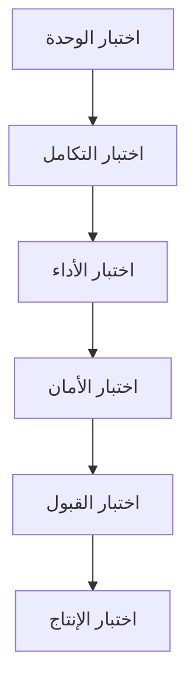

# ملحق ب: خطة الاختبار الشاملة
**الهدف:** ضمان جودة وسلامة كل مرحلة من مراحل التحسين

---

## 1. استراتيجية الاختبار

### 1.1 مستويات الاختبار



### 1.2 معايير النجاح العامة

| المستوى | معيار النجاح | الحد الأدنى |
|---------|--------------|-------------|
| **السلامة** | 0 أخطاء سلامة بيانات | 100% |
| **الأداء** | تحسين أو ثبات الأداء | ≥ 95% |
| **الأمان** | 0 ثغرات أمنية | 100% |
| **الوظائف** | جميع الميزات تعمل | 100% |
| **التوافق** | التطبيق يعمل بدون تعديلات | 100% |

---

## 2. اختبارات المرحلة 0.5 (تنظيف البيانات)

### 2.1 اختبارات السلامة

```sql
-- ملف: tests/phase_0.5/001_data_integrity_tests.sql

-- اختبار 1: التحقق من عدم وجود بيانات يتيمة
DO $$
DECLARE
  test_name TEXT;
  orphan_count INTEGER;
  test_passed BOOLEAN := TRUE;
BEGIN
  -- اختبار الركاب اليتامى
  test_name := 'Orphaned Passengers Check';
  SELECT COUNT(*) INTO orphan_count
  FROM passengers p
  LEFT JOIN bookings b ON p.booking_id = b.booking_id
  WHERE b.booking_id IS NULL;
  
  IF orphan_count > 0 THEN
    RAISE WARNING '[FAILED] %: Found % orphaned passengers', test_name, orphan_count;
    test_passed := FALSE;
  ELSE
    RAISE NOTICE '[PASSED] %', test_name;
  END IF;
  
  -- اختبار الحجوزات اليتيمة
  test_name := 'Orphaned Bookings Check';
  SELECT COUNT(*) INTO orphan_count
  FROM bookings b
  LEFT JOIN users u ON b.user_id = u.user_id
  WHERE u.user_id IS NULL;
  
  IF orphan_count > 0 THEN
    RAISE WARNING '[FAILED] %: Found % orphaned bookings', test_name, orphan_count;
    test_passed := FALSE;
  ELSE
    RAISE NOTICE '[PASSED] %', test_name;
  END IF;
  
  -- اختبار المدفوعات اليتيمة
  test_name := 'Orphaned Payments Check';
  SELECT COUNT(*) INTO orphan_count
  FROM payment_transactions pt
  LEFT JOIN bookings b ON pt.booking_id = b.booking_id
  WHERE pt.booking_id IS NOT NULL AND b.booking_id IS NULL;
  
  IF orphan_count > 0 THEN
    RAISE WARNING '[FAILED] %: Found % orphaned payments', test_name, orphan_count;
    test_passed := FALSE;
  ELSE
    RAISE NOTICE '[PASSED] %', test_name;
  END IF;
  
  IF test_passed THEN
    RAISE NOTICE '✅ All data integrity tests PASSED';
  ELSE
    RAISE EXCEPTION '❌ Some data integrity tests FAILED';
  END IF;
END $$;
```

### 2.2 اختبارات التكرارات

```sql
-- ملف: tests/phase_0.5/002_duplicate_tests.sql

DO $$
DECLARE
  test_name TEXT;
  duplicate_count INTEGER;
  test_passed BOOLEAN := TRUE;
BEGIN
  -- اختبار تكرار رخص السائقين
  test_name := 'Duplicate Driver Licenses';
  SELECT COUNT(*) INTO duplicate_count
  FROM (
    SELECT license_number
    FROM drivers
    WHERE license_number IS NOT NULL
    GROUP BY license_number
    HAVING COUNT(*) > 1
  ) x;
  
  IF duplicate_count > 0 THEN
    RAISE WARNING '[FAILED] %: Found % duplicates', test_name, duplicate_count;
    test_passed := FALSE;
  ELSE
    RAISE NOTICE '[PASSED] %', test_name;
  END IF;
  
  -- اختبار تكرار لوحات الحافلات
  test_name := 'Duplicate Bus License Plates';
  SELECT COUNT(*) INTO duplicate_count
  FROM (
    SELECT license_plate
    FROM buses
    WHERE license_plate IS NOT NULL
    GROUP BY license_plate
    HAVING COUNT(*) > 1
  ) x;
  
  IF duplicate_count > 0 THEN
    RAISE WARNING '[FAILED] %: Found % duplicates', test_name, duplicate_count;
    test_passed := FALSE;
  ELSE
    RAISE NOTICE '[PASSED] %', test_name;
  END IF;
  
  -- اختبار تكرار المقاعد
  test_name := 'Duplicate Seats per Bus';
  SELECT COUNT(*) INTO duplicate_count
  FROM (
    SELECT bus_id, seat_number
    FROM seats
    GROUP BY bus_id, seat_number
    HAVING COUNT(*) > 1
  ) x;
  
  IF duplicate_count > 0 THEN
    RAISE WARNING '[FAILED] %: Found % duplicates', test_name, duplicate_count;
    test_passed := FALSE;
  ELSE
    RAISE NOTICE '[PASSED] %', test_name;
  END IF;
  
  IF test_passed THEN
    RAISE NOTICE '✅ All duplicate tests PASSED';
  ELSE
    RAISE EXCEPTION '❌ Some duplicate tests FAILED';
  END IF;
END $$;
```

---

## 3. اختبارات المرحلة 1 (Foreign Keys)

### 3.1 اختبارات السلامة المرجعية

```sql
-- ملف: tests/phase_1/001_foreign_key_tests.sql

-- اختبار وجود جميع Foreign Keys
DO $$
DECLARE
  expected_fks TEXT[] := ARRAY[
    'fk_user_roles_user',
    'fk_bookings_user',
    'fk_bookings_trip',
    'fk_passengers_booking',
    'fk_passengers_seat',
    'fk_trips_route',
    'fk_trips_bus',
    'fk_drivers_partner'
  ];
  fk_name TEXT;
  fk_exists BOOLEAN;
  all_passed BOOLEAN := TRUE;
BEGIN
  FOREACH fk_name IN ARRAY expected_fks
  LOOP
    SELECT EXISTS (
      SELECT 1 FROM information_schema.table_constraints
      WHERE constraint_name = fk_name
        AND constraint_type = 'FOREIGN KEY'
    ) INTO fk_exists;
    
    IF fk_exists THEN
      RAISE NOTICE '[PASSED] Foreign key % exists', fk_name;
    ELSE
      RAISE WARNING '[FAILED] Foreign key % is missing', fk_name;
      all_passed := FALSE;
    END IF;
  END LOOP;
  
  IF all_passed THEN
    RAISE NOTICE '✅ All foreign key tests PASSED';
  ELSE
    RAISE EXCEPTION '❌ Some foreign keys are missing';
  END IF;
END $$;
```

### 3.2 اختبار CASCADE Behavior

```sql
-- ملف: tests/phase_1/002_cascade_tests.sql

BEGIN;

-- اختبار CASCADE على حذف الحجز
DO $$
DECLARE
  test_booking_id BIGINT;
  passenger_count_before INTEGER;
  passenger_count_after INTEGER;
BEGIN
  -- إنشاء حجز تجريبي
  INSERT INTO bookings (user_id, trip_id, total_price, booking_status)
  VALUES (1, 1, 100, 'test')
  RETURNING booking_id INTO test_booking_id;
  
  -- إنشاء ركاب تجريبيين
  INSERT INTO passengers (booking_id, seat_id, passenger_status)
  VALUES (test_booking_id, 1, 'test');
  
  SELECT COUNT(*) INTO passenger_count_before
  FROM passengers WHERE booking_id = test_booking_id;
  
  -- حذف الحجز
  DELETE FROM bookings WHERE booking_id = test_booking_id;
  
  SELECT COUNT(*) INTO passenger_count_after
  FROM passengers WHERE booking_id = test_booking_id;
  
  IF passenger_count_before > 0 AND passenger_count_after = 0 THEN
    RAISE NOTICE '[PASSED] CASCADE delete works correctly';
  ELSE
    RAISE EXCEPTION '[FAILED] CASCADE delete did not work';
  END IF;
END $$;

ROLLBACK;
```

---

## 4. اختبارات المرحلة 2 (الفهارس)

### 4.1 اختبارات الأداء

```sql
-- ملف: tests/phase_2/001_index_performance_tests.sql

-- تفعيل تتبع الوقت
\timing on

-- اختبار 1: استعلام الحجوزات (يجب أن يستخدم الفهرس)
EXPLAIN ANALYZE
SELECT b.*, u.full_name, t.departure_time
FROM bookings b
JOIN users u ON b.user_id = u.user_id
JOIN trips t ON b.trip_id = t.trip_id
WHERE b.user_id = 1
ORDER BY b.booking_date DESC
LIMIT 20;

-- يجب أن يظهر: Index Scan using idx_bookings_user_id

-- اختبار 2: بحث الرحلات (يجب أن يستخدم الفهرس)
EXPLAIN ANALYZE
SELECT *
FROM trips
WHERE departure_time >= NOW()
  AND departure_time < NOW() + INTERVAL '7 days'
  AND status = 'scheduled'
ORDER BY departure_time;

-- يجب أن يظهر: Index Scan using idx_trips_departure_time

-- اختبار 3: الإشعارات غير المقروءة (يجب أن يستخدم الفهرس)
EXPLAIN ANALYZE
SELECT *
FROM notifications
WHERE user_id = 1
  AND is_read = FALSE
ORDER BY created_at DESC;

-- يجب أن يظهر: Index Scan using idx_notifications_user_unread
```

### 4.2 قياس تحسين الأداء

```sql
-- ملف: tests/phase_2/002_performance_benchmark.sql

-- إنشاء جدول لحفظ نتائج القياس
CREATE TABLE IF NOT EXISTS performance_benchmarks (
  benchmark_id SERIAL PRIMARY KEY,
  query_name VARCHAR(100),
  execution_time_ms NUMERIC,
  rows_returned INTEGER,
  index_used BOOLEAN,
  tested_at TIMESTAMPTZ DEFAULT NOW()
);

-- قياس استعلام الحجوزات
DO $$
DECLARE
  start_time TIMESTAMPTZ;
  end_time TIMESTAMPTZ;
  execution_time NUMERIC;
  row_count INTEGER;
BEGIN
  start_time := clock_timestamp();
  
  SELECT COUNT(*) INTO row_count
  FROM bookings b
  WHERE b.user_id = 1;
  
  end_time := clock_timestamp();
  execution_time := EXTRACT(MILLISECOND FROM (end_time - start_time));
  
  INSERT INTO performance_benchmarks (query_name, execution_time_ms, rows_returned, index_used)
  VALUES ('User Bookings Query', execution_time, row_count, TRUE);
  
  RAISE NOTICE 'Query executed in % ms', execution_time;
END $$;

-- مقارنة الأداء قبل/بعد
SELECT 
  query_name,
  AVG(execution_time_ms) as avg_time,
  MIN(execution_time_ms) as min_time,
  MAX(execution_time_ms) as max_time
FROM performance_benchmarks
GROUP BY query_name;
```

---

## 5. اختبارات المرحلة 3 (RLS)

### 5.1 اختبارات الأمان

```sql
-- ملف: tests/phase_3/001_rls_security_tests.sql

-- اختبار 1: المستخدم يرى حجوزاته فقط
BEGIN;

-- تعيين المستخدم الحالي
SET LOCAL jwt.claims.sub = 'user-uuid-1';

-- محاولة الوصول لحجوزات مستخدم آخر
DO $$
DECLARE
  accessible_bookings INTEGER;
BEGIN
  SELECT COUNT(*) INTO accessible_bookings
  FROM bookings
  WHERE user_id != (SELECT user_id FROM users WHERE auth_id = 'user-uuid-1');
  
  IF accessible_bookings = 0 THEN
    RAISE NOTICE '[PASSED] User cannot access other users bookings';
  ELSE
    RAISE EXCEPTION '[FAILED] User can access % other bookings', accessible_bookings;
  END IF;
END $$;

ROLLBACK;

-- اختبار 2: الشريك يرى بياناته فقط
BEGIN;

SET LOCAL jwt.claims.sub = 'partner-uuid-1';

DO $$
DECLARE
  accessible_trips INTEGER;
BEGIN
  SELECT COUNT(*) INTO accessible_trips
  FROM trips
  WHERE partner_id != (
    SELECT partner_id FROM user_roles 
    WHERE user_id = (SELECT user_id FROM users WHERE auth_id = 'partner-uuid-1')
  );
  
  IF accessible_trips = 0 THEN
    RAISE NOTICE '[PASSED] Partner cannot access other partners trips';
  ELSE
    RAISE EXCEPTION '[FAILED] Partner can access % other trips', accessible_trips;
  END IF;
END $$;

ROLLBACK;
```

### 5.2 اختبار تغطية RLS

```sql
-- ملف: tests/phase_3/002_rls_coverage_tests.sql

-- التحقق من تفعيل RLS على جميع الجداول الحساسة
SELECT 
  schemaname,
  tablename,
  rowsecurity,
  CASE 
    WHEN rowsecurity THEN '✅ ENABLED'
    ELSE '❌ DISABLED'
  END as rls_status
FROM pg_tables
WHERE schemaname = 'public'
  AND tablename IN (
    'bookings', 'passengers', 'payment_transactions',
    'trips', 'buses', 'drivers', 'users', 'refunds'
  )
ORDER BY tablename;

-- يجب أن تكون جميع الجداول ENABLED
```

---

## 6. اختبارات المرحلة 4 (تخطيط الحافلات)

### 6.1 اختبارات الوظائف

```sql
-- ملف: tests/phase_4/001_bus_layout_tests.sql

BEGIN;

-- اختبار 1: إنشاء تخطيط حافلة
DO $$
DECLARE
  test_layout_id INTEGER;
  seats_created INTEGER;
BEGIN
  -- إنشاء تخطيط تجريبي
  INSERT INTO bus_layouts (partner_id, name, total_seats)
  VALUES (1, 'Test Layout', 40)
  RETURNING layout_id INTO test_layout_id;
  
  -- إنشاء مقاعد التخطيط
  INSERT INTO bus_layout_seats (layout_id, class_id, seat_number, row_num, col_num)
  SELECT 
    test_layout_id,
    1, -- VIP class
    'A' || generate_series::TEXT,
    (generate_series - 1) / 4 + 1,
    (generate_series - 1) % 4 + 1
  FROM generate_series(1, 40);
  
  SELECT COUNT(*) INTO seats_created
  FROM bus_layout_seats
  WHERE layout_id = test_layout_id;
  
  IF seats_created = 40 THEN
    RAISE NOTICE '[PASSED] Bus layout created with correct number of seats';
  ELSE
    RAISE EXCEPTION '[FAILED] Expected 40 seats, got %', seats_created;
  END IF;
END $$;

-- اختبار 2: دالة إنشاء مقاعد الرحلة
DO $$
DECLARE
  test_trip_id BIGINT := 1;
  test_bus_id BIGINT := 1;
  seats_created INTEGER;
BEGIN
  -- استدعاء الدالة
  SELECT create_trip_seats_from_layout(test_trip_id, test_bus_id)
  INTO seats_created;
  
  IF seats_created > 0 THEN
    RAISE NOTICE '[PASSED] Created % seats for trip', seats_created;
  ELSE
    RAISE EXCEPTION '[FAILED] No seats created';
  END IF;
END $$;

-- اختبار 3: دالة المقاعد المتاحة
DO $$
DECLARE
  available_seats INTEGER;
BEGIN
  SELECT COUNT(*) INTO available_seats
  FROM get_available_seats_for_trip(1);
  
  IF available_seats > 0 THEN
    RAISE NOTICE '[PASSED] Found % available seats', available_seats;
  ELSE
    RAISE WARNING '[WARNING] No available seats found';
  END IF;
END $$;

ROLLBACK;
```

---

## 7. اختبارات التطبيق (Integration Tests)

### 7.1 سيناريوهات المستخدم النهائي

```typescript
// tests/integration/booking_flow.test.ts

describe('Booking Flow Integration Tests', () => {
  test('User can search for trips', async () => {
    const response = await searchTrips({
      origin: 'Riyadh',
      destination: 'Jeddah',
      date: '2026-02-01'
    });
    
    expect(response.status).toBe(200);
    expect(response.data.trips).toBeDefined();
    expect(response.data.trips.length).toBeGreaterThan(0);
  });
  
  test('User can view available seats', async () => {
    const tripId = 1;
    const response = await getAvailableSeats(tripId);
    
    expect(response.status).toBe(200);
    expect(response.data.seats).toBeDefined();
    expect(response.data.seats[0]).toHaveProperty('seat_number');
    expect(response.data.seats[0]).toHaveProperty('class_name');
  });
  
  test('User can create booking', async () => {
    const bookingData = {
      trip_id: 1,
      seat_ids: [1, 2],
      passengers: [
        { name: 'Test User 1', id_number: '1234567890' },
        { name: 'Test User 2', id_number: '0987654321' }
      ]
    };
    
    const response = await createBooking(bookingData);
    
    expect(response.status).toBe(201);
    expect(response.data.booking_id).toBeDefined();
    expect(response.data.total_price).toBeGreaterThan(0);
  });
  
  test('User can process payment', async () => {
    const bookingId = 1;
    const paymentData = {
      amount: 200,
      payment_method: 'credit_card'
    };
    
    const response = await processPayment(bookingId, paymentData);
    
    expect(response.status).toBe(200);
    expect(response.data.payment_status).toBe('completed');
  });
});
```

### 7.2 اختبارات الأداء الشاملة

```typescript
// tests/performance/load_test.ts

import { check } from 'k6';
import http from 'k6/http';

export const options = {
  stages: [
    { duration: '2m', target: 100 }, // ramp up
    { duration: '5m', target: 100 }, // stay at 100 users
    { duration: '2m', target: 200 }, // ramp up
    { duration: '5m', target: 200 }, // stay at 200 users
    { duration: '2m', target: 0 },   // ramp down
  ],
  thresholds: {
    http_req_duration: ['p(95)<500'], // 95% of requests < 500ms
    http_req_failed: ['rate<0.01'],   // < 1% errors
  },
};

export default function () {
  // Test search trips
  const searchResponse = http.get(
    'https://api.example.com/trips?origin=Riyadh&destination=Jeddah'
  );
  check(searchResponse, {
    'search status is 200': (r) => r.status === 200,
    'search response time < 500ms': (r) => r.timings.duration < 500,
  });
  
  // Test get available seats
  const seatsResponse = http.get('https://api.example.com/trips/1/seats');
  check(seatsResponse, {
    'seats status is 200': (r) => r.status === 200,
    'seats response time < 300ms': (r) => r.timings.duration < 300,
  });
}
```

---

## 8. معايير القبول لكل مرحلة

### 8.1 المرحلة 0.5

- [ ] 0 بيانات يتيمة
- [ ] 0 تكرارات
- [ ] 0 قيم غير صالحة
- [ ] جميع اختبارات السلامة ناجحة

### 8.2 المرحلة 1

- [ ] جميع Foreign Keys مضافة
- [ ] CASCADE behavior يعمل بشكل صحيح
- [ ] 0 انتهاكات للسلامة المرجعية
- [ ] الأداء لم يتأثر سلباً (< 5% تباطؤ)

### 8.3 المرحلة 2

- [ ] جميع الفهارس مضافة
- [ ] الاستعلامات تستخدم الفهارس
- [ ] تحسين الأداء بنسبة ≥ 50%
- [ ] حجم قاعدة البيانات زاد بأقل من 20%

### 8.4 المرحلة 3

- [ ] RLS مفعل على جميع الجداول الحساسة
- [ ] اختبارات الأمان ناجحة 100%
- [ ] المستخدمون لا يرون بيانات بعضهم
- [ ] الشركاء معزولون عن بعضهم

### 8.5 المرحلة 4

- [ ] نظام التخطيط يعمل بشكل كامل
- [ ] دوال المساعدة تعمل بشكل صحيح
- [ ] المقاعد المتاحة تحسب بدقة
- [ ] التطبيق متوافق مع النظام الجديد

---

## ✅ قائمة التحقق النهائية

### قبل كل مرحلة:
- [ ] جميع الاختبارات على staging ناجحة
- [ ] الأداء مقبول
- [ ] النسخة الاحتياطية محفوظة
- [ ] خطة Rollback جاهزة

### بعد كل مرحلة:
- [ ] جميع الاختبارات على الإنتاج ناجحة
- [ ] لا توجد أخطاء في السجلات
- [ ] الأداء ضمن النطاق المقبول
- [ ] التطبيق يعمل بشكل طبيعي
